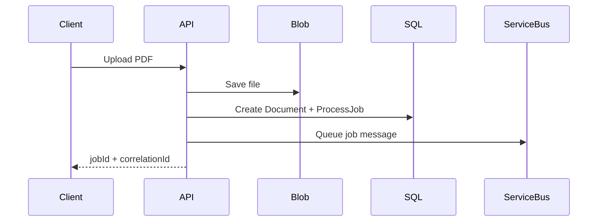
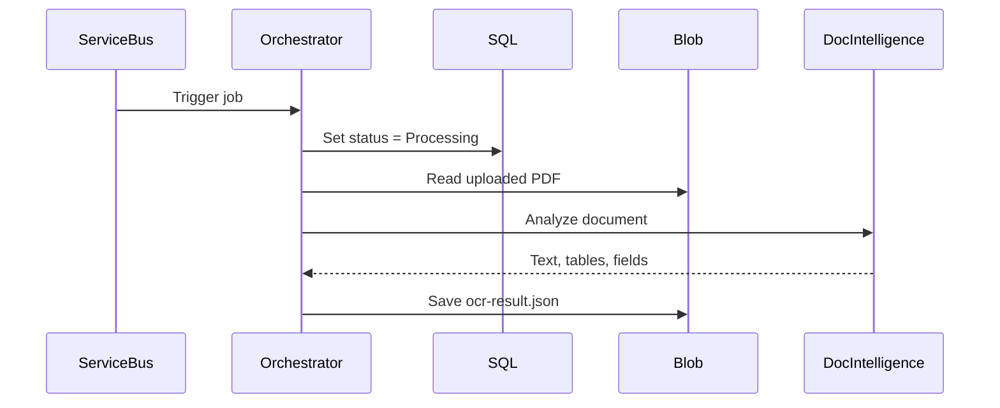
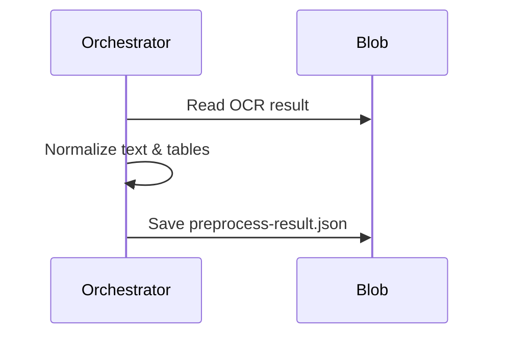
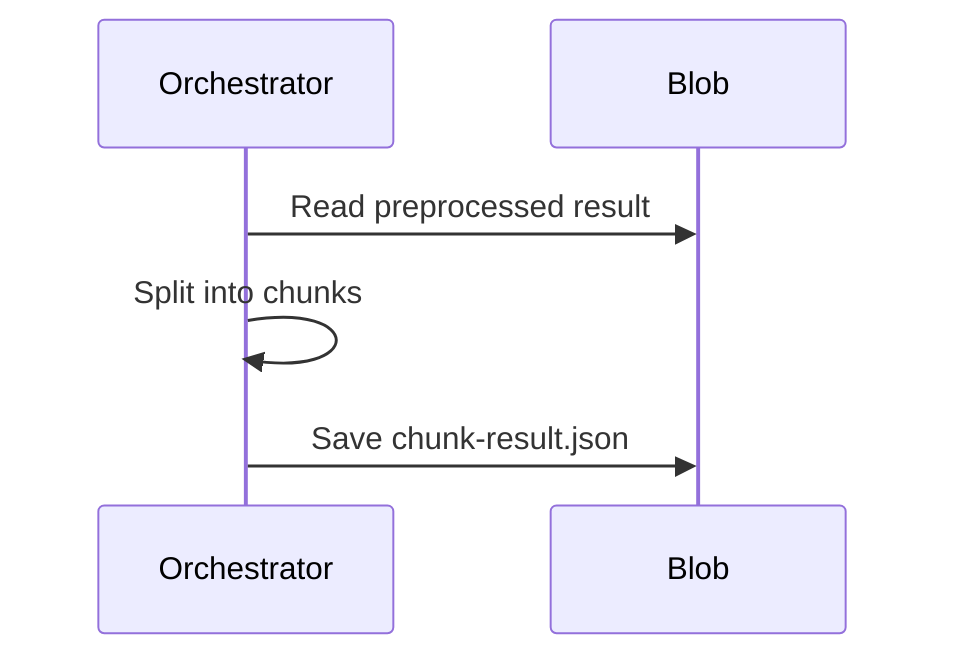
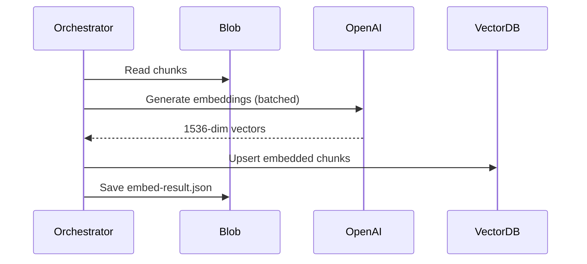
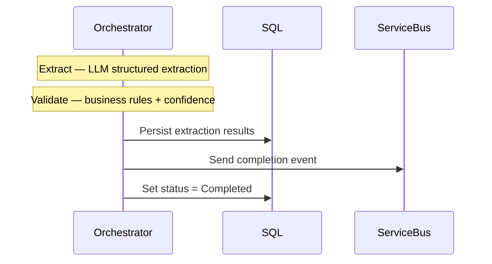
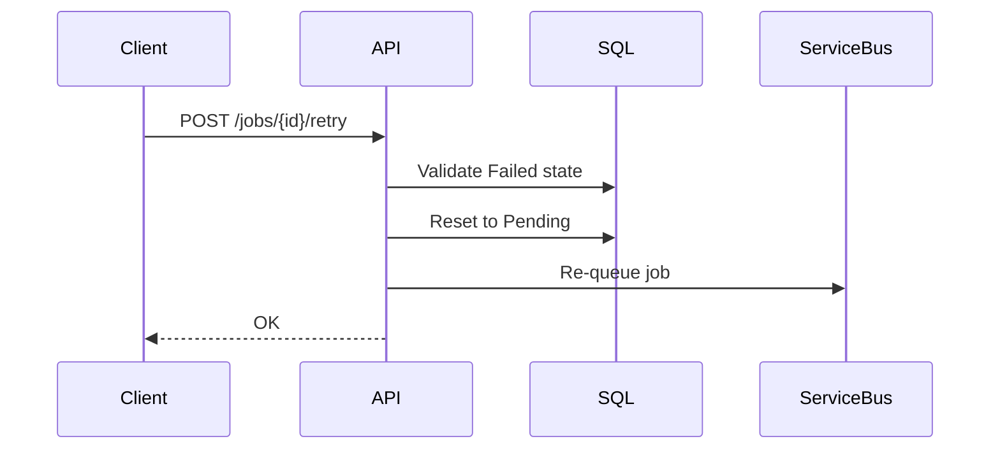

# Architecture & Pipeline Flow

## 1. Document Upload

A user uploads a PDF through the web app. The API saves the file, creates a tracking record in the database, and puts a message on the queue so the worker knows there's a new document to process.

## 2. OCR Stage

The worker picks up the message and starts processing. First, it sends the PDF to Azure Document Intelligence, which "reads" the document and returns the raw text, tables, and form fields it found — along with where each piece is located on the page.

## 3. Preprocessing Stage

The raw OCR output is messy — extra whitespace, inconsistent Unicode characters, tables as unstructured text. This stage cleans everything up: normalizes text, converts tables into structured formats, and parses dates and currency values into consistent representations.

## 4. Chunking Stage

A full document is too large to send to an AI model at once. This stage splits it into small, meaningful pieces — keeping sentences together, preserving table boundaries, and adding overlap between chunks so context isn't lost at the edges.

## 5. Embedding Stage

Each chunk is converted into a numerical vector (a list of ~1,500 numbers) using OpenAI's embedding model. Chunks with similar meaning get similar vectors — this is what makes it possible to later search for "the part about payment terms" without needing exact keyword matches. The vectors are stored in a vector database for fast similarity search.

## 6. Remaining Stages (planned)

**Extract** — an LLM reads the most relevant chunks and pulls out structured data (invoice number, dates, amounts) as JSON with source citations. **Validate** — business rules check the extracted data for consistency, and low-confidence results get flagged for human review. **Persist** — results are saved to the database. **Notify** — a completion event is published so other systems know the document is ready.

## 7. Retry Flow

If a job fails (API timeout, transient error, etc.), it can be retried. The API validates the job is actually in a failed state, resets it, and re-queues it for processing. The entire pipeline runs again from the beginning.

## 8. Local Dev Stack

`docker compose up -d` starts all infrastructure. Then run API + Worker locally.

| Layer | Service | Port | How |
|-------|---------|------|-----|
| **Docker** | SQL Server | 1433 | docker compose |
| **Docker** | pgvector (PostgreSQL) | 5433 | docker compose |
| **Docker** | Azurite (Blob/Queue/Table) | 10000-10002 | docker compose |
| **Docker** | Service Bus Emulator | 5672 | docker compose |
| **Local** | API Functions | 7071 | `func start` |
| **Local** | Worker Orchestrator | 7072 | `func start` |
| **Local** | Angular Client | 4200 | `npm start` |
| **Cloud** | OpenAI API | — | API key in `.env` |
