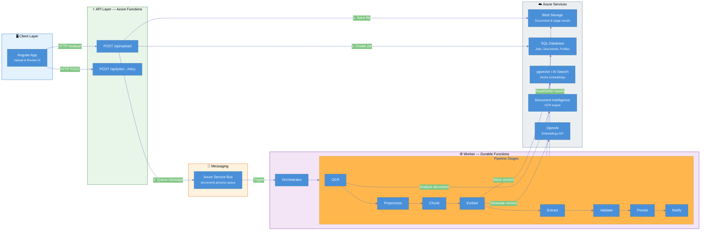
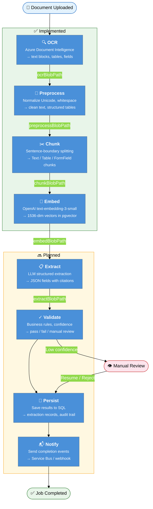
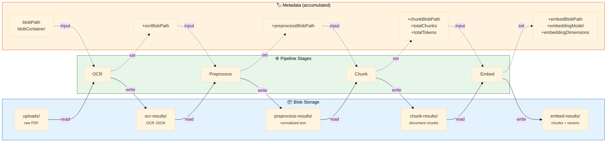
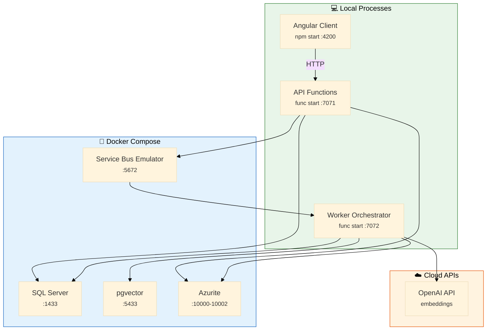

# Architecture & Pipeline Flow

## 1. System Architecture

How the major components connect. The client uploads documents to the API, which queues processing jobs. The Worker picks them up and drives them through the pipeline.

## 2. Document Pipeline Flow

The journey of a single document from upload to completion. Green stages are fully implemented; dashed stages are scaffolded but not yet wired to real services.

## 3. Data & Metadata Flow

Each stage reads input from Blob Storage, processes it, writes output back, and passes metadata keys to the next stage via the orchestrator.

## 4. Local Development Stack

Everything runs with a single `docker compose up -d`:

