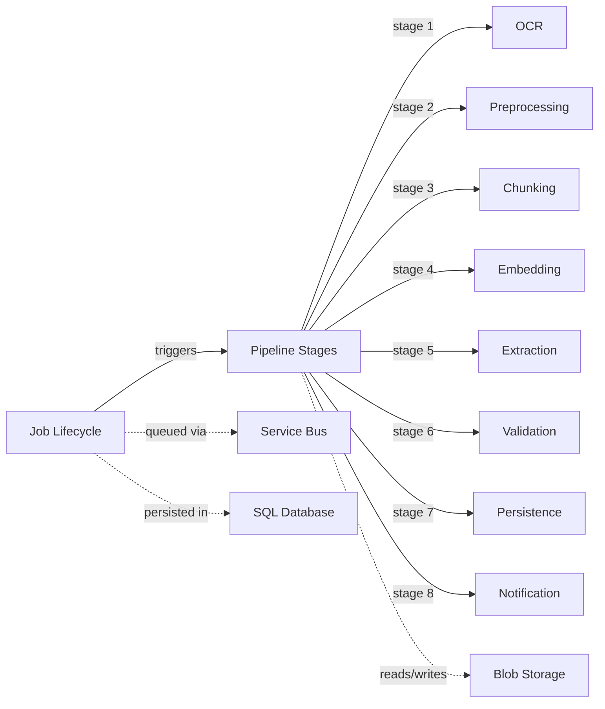

# Document AI Pipeline — Business Logic Overview

## Business Summary

Document AI Pipeline ("docproc") is a serverless document processing system built on Azure Functions with Clean Architecture. It ingests documents (PDFs, images, scanned forms), runs them through a multi-stage processing pipeline, and produces structured, searchable data.

Documents enter the system via HTTP upload, which triggers an Azure Durable Functions orchestration. The orchestration drives the document through eight sequential stages: OCR, Preprocessing, Chunking, Embedding, Extraction, Validation, Persistence, and Notification. Each stage is independently testable, produces metadata for downstream stages, and reports success/failure back to the orchestrator.

The system enforces idempotency (same document + tenant + extraction profile = same job), optimistic concurrency (RowVersion-based), and full distributed tracing via correlation IDs.

## Glossary

| Term | Definition |
|------|-----------|
| **ProcessJob** | The central workflow entity tracking a document's progress through all pipeline stages. Has a Status (lifecycle state) and Stage (current pipeline position). |
| **Document** | A file (PDF, image, etc.) uploaded to blob storage. Linked to one or more ProcessJobs. |
| **Stage** | A discrete step in the processing pipeline (e.g., OCR, Chunk, Extract). Each stage has an Activity that performs the work and an Executor that wires it into the orchestrator. |
| **Status** | The lifecycle state of a ProcessJob: Pending, Processing, Completed, Failed, or ManualReview. |
| **StageResult** | The return value of a stage activity — either success (with metadata) or failure (with error code and message). |
| **StageContext** | The input to a stage activity — contains the job ID, document ID, correlation ID, and accumulated metadata from prior stages. |
| **StageMetadataKeys** | Centralized constants for metadata dictionary keys passed between stages (e.g., `blobPath`, `chunkBlobPath`, `totalTokens`). |
| **CorrelationId** | A unique identifier assigned at job creation, propagated through all stages and logs for distributed tracing. |
| **IdempotencyKey** | SHA256 hash of (tenant ID + document hash + extraction profile). Prevents duplicate processing of the same document. |
| **TenantId** | Identifies the tenant/customer that owns the document. Used for blob storage path partitioning and idempotency. |
| **ExtractionProfile** | An optional configuration name that controls how data is extracted from a document (different profiles for invoices vs. contracts, etc.). |
| **Chunk** | A semantically meaningful piece of document content (text paragraph, table, form fields) sized for embedding models. |
| **ChunkType** | The origin content type of a chunk: Text (prose), Table (structured rows/columns), or FormField (key-value pairs). |

## User Roles

<!-- TODO: clarify with team — no role/permission model defined yet -->

## Domain Area Map

## Table of Contents

- [Architecture & Pipeline Flow](../architecture.md) — System architecture, pipeline stages diagram, data flow, local dev stack
- [Job Lifecycle](job-lifecycle.md) — ProcessJob state machine, status transitions, idempotency, concurrency
- [Pipeline Stages](pipeline-stages.md) — Stage execution model, metadata forwarding, error handling patterns
- [Document Chunking](document-chunking.md) — Chunking strategy, chunk types, token estimation, overlap
- [Embeddings Pipeline](embeddings-pipeline.md) — Embedding generation, dual vector store (pgvector/Azure AI Search), batch processing, cost considerations
- [Decision Log](_decision-log.md) — Chronological record of non-obvious design decisions
