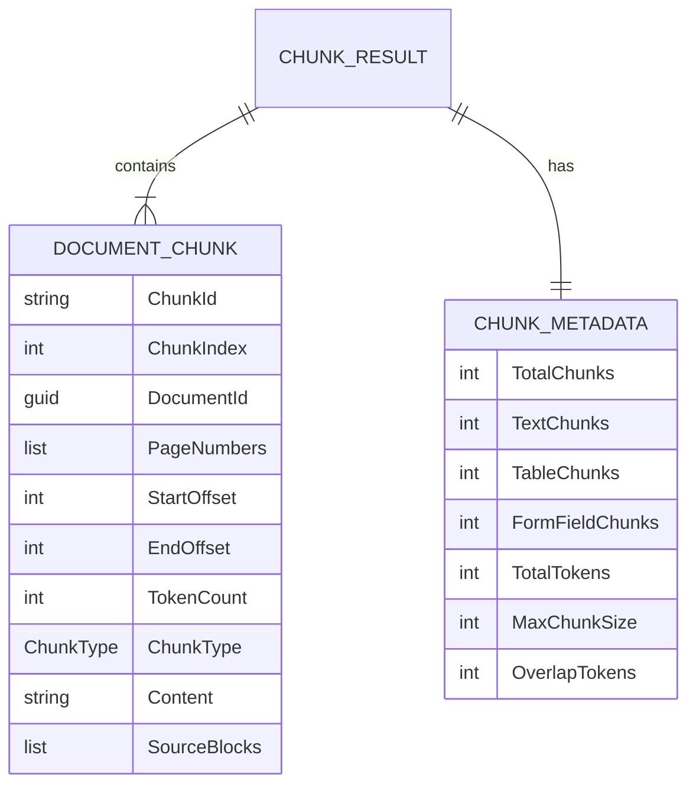
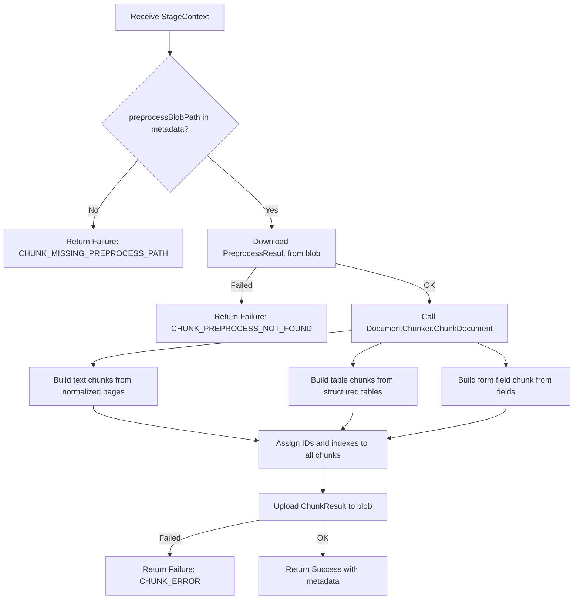

# Document Chunking

## Table of Contents

- [Purpose](#purpose)
- [Key Entities](#key-entities)
- [Constraints](#constraints)
- [Business Rules & Invariants](#business-rules--invariants)
- [Workflows & State Transitions](#workflows--state-transitions)
- [Decision Trees](#decision-trees)
- [Integration Points](#integration-points)
- [Edge Cases & Known Gotchas](#edge-cases--known-gotchas)

## Purpose

The chunking stage splits preprocessed document content into semantically meaningful, token-bounded pieces suitable for embedding models and downstream extraction. It handles three distinct content types (text, tables, form fields) with type-specific strategies, producing chunks with full provenance metadata (page numbers, character offsets, source block lineage).

## Key Entities



**ChunkType** — origin content type:

| Value | Description |
|-------|-------------|
| `Text` | Plain prose or narrative text extracted from document pages |
| `Table` | Serialized table content (JSON rows/columns) from a structured table |
| `FormField` | Key-value content from parsed form fields |

**ChunkingOptions** — configuration:

| Property | Default | Description |
|----------|---------|-------------|
| `MaxChunkSize` | 512 | Maximum token count per chunk |
| `OverlapTokens` | 50 | Number of overlapping tokens between consecutive text chunks |
| `TokenEstimationFactor` | 1.3 | Multiplier: estimated tokens = ceil(word count x factor) |
| `OutputBlobContainer` | `"chunk-results"` | Blob container for output |

## Constraints

### MUST

- **MaxChunkSize > 0, TokenEstimationFactor > 0, OverlapTokens < MaxChunkSize**: Validated at the start of `ChunkDocument()`. Throws `ArgumentException` if violated.
  - **Why**: Zero or negative values would cause infinite loops or division errors. Overlap >= MaxChunkSize means every chunk would consist entirely of overlap with no new content.
  - **Enforced in**: `DocumentChunker.ChunkDocument()` guard clauses

- **Every character in the full document text belongs to exactly one chunk**: No gaps between text chunks and no character-level overlaps. Overlap is achieved by re-including prior sentences, not by overlapping character offset ranges.
  - **Why**: Ensures complete coverage — no text is lost during chunking. Overlap for embedding context is at the semantic (sentence) level, not the character level.
  - **Enforced in**: `DocumentChunker.BuildTextChunks()` — `StartOffset` of chunk N+1 equals `EndOffset` of chunk N

- **Chunk ordering is deterministic**: Text chunks first (in document order), then table chunks (sorted by page number, then table number), then the form field chunk (if any).
  - **Why**: Deterministic ordering ensures reproducible results and stable chunk IDs across re-processing.
  - **Enforced in**: `DocumentChunker.ChunkDocument()` — concatenation order

- **ChunkId format is `doc-{documentId}-chunk-{index:D4}`**: Assigned after all chunks are created and ordered.
  - **Why**: Stable, unique identifiers enable downstream systems to reference specific chunks. Zero-padded index preserves sort order as strings.
  - **Enforced in**: `DocumentChunker.AssignIdsAndIndexes()`

### MUST NOT

- **Must not reject oversized single items**: If a single sentence or table exceeds `MaxChunkSize`, it is included as-is. The chunker never drops content.
  - **Why**: Rejecting content would cause data loss. Infinite loops would occur if the chunker tried to split a single atomic item. See [Decision Log](_decision-log.md#2026-03-04--single-oversized-items-included-as-is-in-chunks).
  - **Enforced in**: `DocumentChunker.BuildTextChunks()` — always advances at least one sentence per iteration

## Business Rules & Invariants

---

- **Rule**: Token count is estimated as `ceil(wordCount x TokenEstimationFactor)` where words are counted by walking characters and counting whitespace transitions.
- **Why**: Exact tokenization requires a model-specific tokenizer (e.g., tiktoken for OpenAI). Factor-based estimation is fast, allocation-free, and close enough for chunking decisions. The factor (default 1.3) accounts for subword tokenization expanding word count.
- **Enforced in**: `DocumentChunker.EstimateTokens()` — manual character loop, no string allocations
- **Example**: Text "The quick brown fox" has 4 words. With factor 1.3: `ceil(4 x 1.3) = ceil(5.2) = 6` estimated tokens.
- **Source**: `[SOURCE: code-audit — unconfirmed]`

---

- **Rule**: Text chunks use sentence-boundary splitting. The regex `(?<=[.!?])\s+(?=[A-Z\n])` detects sentence boundaries. Fallback: split on newlines, then on whitespace at ~200 character windows.
- **Why**: Sentence-boundary splitting preserves semantic coherence for embedding quality. The fallback chain handles text without standard punctuation (e.g., bullet lists, code blocks). See [Decision Log](_decision-log.md#2026-03-04--sentence-boundary-chunking-over-fixed-size-windowing).
- **Enforced in**: `DocumentChunker.SplitIntoSentences()`, `DocumentChunker.SentenceBoundaryRegex()`
- **Example**: "The system processed 500 documents. Each document averaged 10 pages." splits into two sentences at the period-space boundary.
- **Counterexample**: "Dr. Smith reviewed the file." — the regex does NOT split after "Dr." because the next character is uppercase "S", making this a false positive risk. In practice, the abbreviation followed by a space and capital letter is rare enough that the tradeoff is acceptable.
- **Source**: `[SOURCE: code-audit — unconfirmed]`

---

- **Rule**: Overlap between consecutive text chunks is achieved by re-including sentences from the end of the previous chunk at the start of the next chunk. The number of overlapping tokens is controlled by `OverlapTokens`.
- **Why**: Overlap ensures that information at chunk boundaries is not lost for embedding and retrieval. Sentence-level overlap preserves semantic meaning better than character-level overlap.
- **Enforced in**: `DocumentChunker.BuildTextChunks()` — backward walk from chunk end until overlap token budget reached
- **Example**: Chunk 1 ends with sentences S5, S6. Chunk 2 starts with S6, S7, S8... where S6 is re-included because its token count fits within `OverlapTokens`.
- **Source**: `[SOURCE: code-audit — unconfirmed]`

---

- **Rule**: Each `StructuredTable` becomes its own chunk with content set to the table's JSON representation.
- **Why**: Tables have internal structure (rows, columns) that should not be split across chunks. JSON preserves the tabular structure for downstream extraction.
- **Enforced in**: `DocumentChunker.BuildTableChunks()`
- **Example**: A 3-column, 10-row table on page 5 becomes one Table chunk with `PageNumbers = [5]` and content = the JSON serialization.
- **Source**: `[SOURCE: code-audit — unconfirmed]`

---

- **Rule**: All form fields are combined into a single chunk (if any exist). Content is formatted as `key: value` pairs separated by newlines.
- **Why**: Form fields are typically small key-value pairs. Combining them into one chunk keeps related fields together for extraction context.
- **Enforced in**: `DocumentChunker.BuildFormFieldChunk()`
- **Example**: Three form fields ("Name: John", "Date: 2026-01-01", "Amount: $500") become one FormField chunk with content = `"Name: John\nDate: 2026-01-01\nAmount: $500"`.
- **Source**: `[SOURCE: code-audit — unconfirmed]`

---

- **Rule**: Text chunks track `SourceBlocks` — the zero-based indexes of `NormalizedTextBlock`s that contributed content to the chunk.
- **Why**: Enables traceability from a chunk back to the original preprocessing output. Useful for debugging, provenance tracking, and potential re-chunking.
- **Enforced in**: `DocumentChunker.BuildTextChunks()` — block index range tracked alongside character offsets
- **Example**: A chunk spanning characters 500-1200 that overlaps with blocks 3, 4, and 5 has `SourceBlocks = [3, 4, 5]`.
- **Source**: `[SOURCE: code-audit — unconfirmed]`

## Workflows & State Transitions

### Chunk Stage Execution



## Decision Trees

### Sentence Splitting Strategy

```
IF text contains sentence boundaries (regex matches)
  THEN split on sentence boundaries
ELSE IF text contains newlines
  THEN split on newlines
ELSE
  THEN split on whitespace at ~200 character windows
```

### Chunk Type Assignment

```
FOR each NormalizedTextBlock page in PreprocessResult
  THEN create Text chunks (sentence-split with overlap)
FOR each StructuredTable in PreprocessResult
  THEN create one Table chunk per table
IF FormFields.Count > 0
  THEN create one FormField chunk containing all fields
```

## Integration Points

- **Blob Storage (input)**: Downloads `PreprocessResult` from `{preprocessBlobPath}` in the tenant's container. The path comes from the Preprocess stage via metadata.
- **Blob Storage (output)**: Uploads `ChunkResult` (chunks + metadata + timing) to `{outputContainer}/{tenantId}/{documentId}/chunk-result.json`.
- **Preprocess Stage**: Produces the `PreprocessResult` containing `NormalizedTextBlocks`, `StructuredTables`, and `FormFields` that the chunker consumes.
- **Embed Stage** (downstream): Consumes the `chunkBlobPath` metadata key to download chunks for vector embedding generation.

## Edge Cases & Known Gotchas

- **Abbreviations as false sentence boundaries**: The regex `(?<=[.!?])\s+(?=[A-Z\n])` can incorrectly split at abbreviations like "Dr. Smith" or "U.S. Army". This is an accepted tradeoff — the impact on embedding quality is minimal because the overlap mechanism ensures context is preserved across the false boundary.
- **Empty documents**: If the PreprocessResult has no text blocks, no tables, and no form fields, the chunker produces zero chunks with `TotalChunks = 0`. This is a valid result, not an error.
- **Very long single sentences**: A single sentence exceeding `MaxChunkSize` tokens (e.g., a legal paragraph without periods) becomes one oversized chunk. The `ChunkMetadata.MaxChunkSize` field preserves the configured limit so downstream consumers can detect this.
- **Form field trailing newline**: The form field chunk content uses `string.Join('\n', ...)` to avoid a trailing newline after the last field.
- **Thread safety**: `DocumentChunker` is registered as a Singleton. All methods are pure functions with no shared mutable state — safe for concurrent use across multiple requests.
