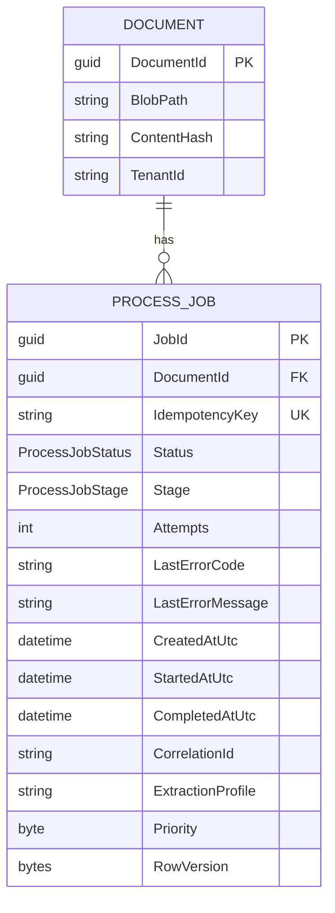
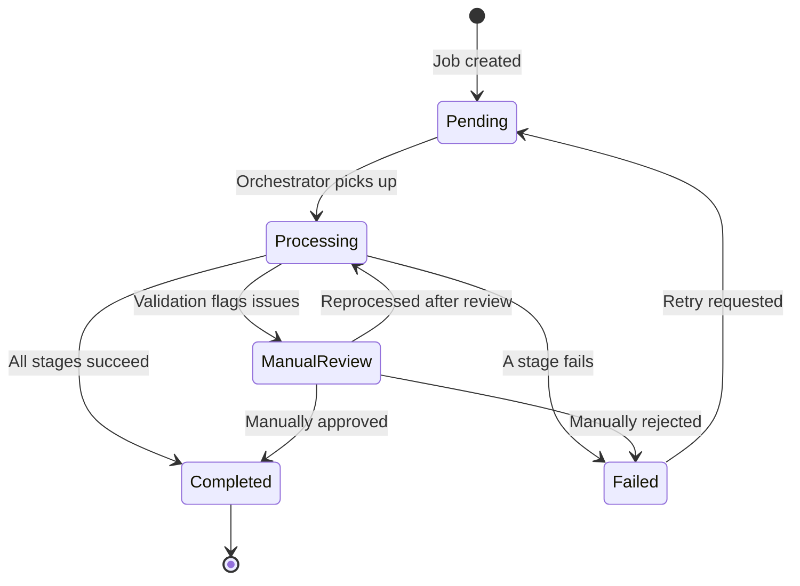
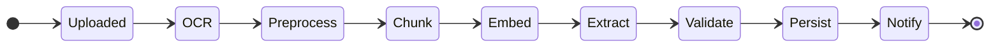

# Job Lifecycle

## Table of Contents

- [Purpose](#purpose)
- [Key Entities](#key-entities)
- [Constraints](#constraints)
- [Business Rules & Invariants](#business-rules--invariants)
- [Workflows & State Transitions](#workflows--state-transitions)
- [Integration Points](#integration-points)
- [Edge Cases & Known Gotchas](#edge-cases--known-gotchas)

## Purpose

The job lifecycle governs how a document moves through the processing pipeline. A `ProcessJob` is created when a document is uploaded, tracks progress through sequential stages, and terminates in a final status (Completed, Failed, or ManualReview). The lifecycle enforces idempotency, concurrency safety, and ordered stage progression.

## Key Entities

**ProcessJobStatus** — lifecycle state:

| Value | Meaning |
|-------|---------|
| `Pending` | Waiting to be picked up for processing |
| `Processing` | Currently being processed through pipeline stages |
| `Completed` | All stages finished successfully |
| `Failed` | A stage failed; job may be retryable |
| `ManualReview` | Requires human intervention before continuing |

**ProcessJobStage** — current pipeline position:

| Value | Order | Description |
|-------|-------|-------------|
| `Uploaded` | 0 | Document stored in blob storage |
| `OCR` | 1 | Optical character recognition / layout extraction |
| `Preprocess` | 2 | Text normalization and structuring |
| `Chunk` | 3 | Split into semantic chunks for embedding |
| `Embed` | 4 | Generate vector embeddings |
| `Extract` | 5 | Structured data extraction via LLM |
| `Validate` | 6 | Business rule validation of extracted data |
| `Persist` | 7 | Save results to database |
| `Notify` | 8 | Send completion notifications |

## Constraints

### MUST

- **Idempotency key is unique per (tenant, document hash, extraction profile)**: Computed as SHA256 hash. Prevents duplicate processing of the same document with the same configuration.
  - **Why**: Without idempotency, re-uploading or retrying would create duplicate jobs, wasting resources and producing conflicting results.
  - **Enforced in**: `ProcessJobService.ComputeIdempotencyKey()`, unique DB index `IX_ProcessJobs_DocumentId_IdempotencyKey`

- **Optimistic concurrency via RowVersion**: Every status/stage update checks the RowVersion. Concurrent updates cause `DbUpdateConcurrencyException`, triggering retry with exponential backoff (up to 3 attempts).
  - **Why**: Multiple workers or orchestrator retries could attempt to update the same job simultaneously.
  - **Enforced in**: `ProcessJob.RowVersion` (EF Core `[Timestamp]`), `ProcessJobService` retry loops

- **CorrelationId propagated through all stages and logs**: Every ProcessJob has a CorrelationId assigned at creation. All log entries and stage activities include it.
  - **Why**: Enables end-to-end distributed tracing across Azure Functions, Service Bus, and blob storage operations.
  - **Enforced in**: `StageContext.CorrelationId`, structured logging throughout

### MUST NOT

- **Status transitions must follow the valid state machine**: See [Workflows & State Transitions](#workflows--state-transitions) below.
  - **Why**: Invalid transitions would leave jobs in inconsistent states, breaking retry logic and reporting.
  - **Enforced in**: `ProcessJobService` validates transitions; `InvalidStateTransitionException` thrown on violation

- **Stages must not be skipped or reordered**: The pipeline executes stages in fixed sequential order.
  - **Why**: Each stage depends on the output of the previous stage (e.g., Chunk needs Preprocess output, Embed needs Chunk output).
  - **Enforced in**: `DocumentProcessingOrchestrator` calls stages in fixed order

## Business Rules & Invariants

---

- **Rule**: A job's `Attempts` counter increments each time processing starts (Pending → Processing transition).
- **Why**: Enables monitoring of retry frequency and setting max-retry thresholds.
- **Enforced in**: `ProcessJobService.StartProcessingAsync()`
- **Example**: A job fails at the OCR stage due to a transient Azure error. It's retried via `POST /api/jobs/{jobId}/retry`, which resets status to Pending. When the orchestrator picks it up again, Attempts goes from 1 to 2.
- **Source**: `[SOURCE: code-audit — unconfirmed]`

---

- **Rule**: `StartedAtUtc` is set when a job transitions from Pending to Processing. `CompletedAtUtc` is set when it reaches Completed or Failed.
- **Why**: Enables duration tracking and SLA monitoring.
- **Enforced in**: `ProcessJobService.StartProcessingAsync()`, `ProcessJobService.CompleteJobAsync()`, `ProcessJobService.FailJobAsync()`
- **Example**: A job starts at 10:00:00, completes at 10:00:45. Duration = 45 seconds, logged with the CorrelationId.
- **Source**: `[SOURCE: code-audit — unconfirmed]`

---

- **Rule**: Priority is a byte (0-255). Higher value = higher priority. Jobs are dequeued in priority order, then by creation time.
- **Why**: Allows urgent documents (e.g., regulatory filings) to be processed ahead of routine uploads.
- **Enforced in**: DB index `IX_ProcessJobs_Status_Priority`, query ordering in `ProcessJobService`
- **Example**: Two pending jobs: Job A (priority 0, created 10:00) and Job B (priority 100, created 10:05). Job B is picked up first despite being created later.
- **Source**: `[SOURCE: code-audit — unconfirmed]`

---

- **Rule**: Failed jobs can be retried via `POST /api/jobs/{jobId}/retry`. This resets status to Pending, allowing the orchestrator to re-process from the beginning.
- **Why**: Transient failures (network timeouts, throttling) are common in cloud environments and should be recoverable without manual intervention.
- **Enforced in**: `RetryJobFunction`, `ProcessJobService`
- **Example**: A job fails due to a Service Bus timeout. An operator calls the retry endpoint. The job resets to Pending and is re-processed successfully on the next attempt.
- **Counterexample**: Retrying a Completed job would be invalid — the system rejects this with a 409 Conflict.
- **Source**: `[SOURCE: code-audit — unconfirmed]`

## Workflows & State Transitions

### Job Status State Machine

| Transition | Triggered by | Validations |
|---|---|---|
| Pending → Processing | Orchestrator starts job | Job exists, status is Pending, concurrency check |
| Processing → Completed | All stages succeed | Job is Processing |
| Processing → Failed | Stage returns failure | Job is Processing, error code/message recorded |
| Processing → ManualReview | Validation stage flags issues | Job is Processing |
| ManualReview → Processing | Operator approves reprocessing | Job is ManualReview |
| ManualReview → Completed | Operator manually approves | Job is ManualReview |
| ManualReview → Failed | Operator manually rejects | Job is ManualReview |
| Failed → Pending | Retry API called | Job is Failed |

### Pipeline Stage Progression

Stages always execute in this fixed order. If any stage fails, the job transitions to Failed status and the stage field records where it stopped.

## Integration Points

- **Azure Service Bus**: Job creation publishes a message to the processing queue. The orchestrator's Service Bus trigger picks up the message and starts the Durable Functions orchestration.
- **Azure SQL Database**: ProcessJob and Document entities persisted via Entity Framework Core. Optimistic concurrency via RowVersion.
- **Azure Durable Functions**: The orchestrator manages stage sequencing, retry policies, and error handling. Each stage is an Activity Function.

## Edge Cases & Known Gotchas

- **Concurrent retries**: If two retry requests arrive simultaneously for the same failed job, optimistic concurrency ensures only one succeeds. The other gets a concurrency conflict after 3 retry attempts.
- **ManualReview transitions not fully implemented**: The ManualReview status exists in the enum and the state machine diagram above reflects the intended design, but the service methods for ManualReview transitions are not yet implemented. See `TECH_DEBT_ProcessJob_State_Transitions.md` for details.
- **StartedAtUtc can be null on Failed jobs**: If a job fails during the Pending → Processing transition itself (e.g., concurrency exhaustion), `StartedAtUtc` may be null even though the job is Failed. Duration calculations must handle this.
