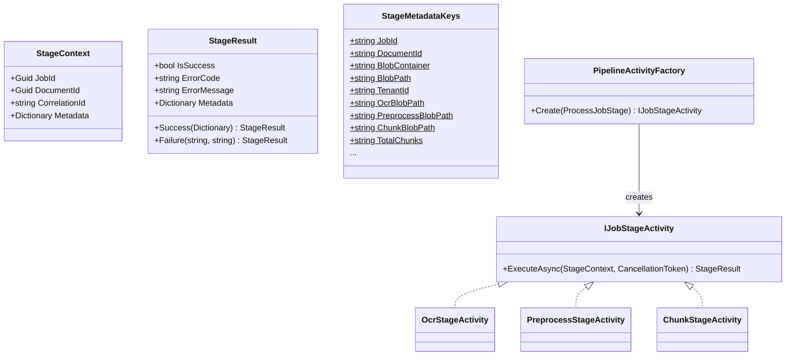
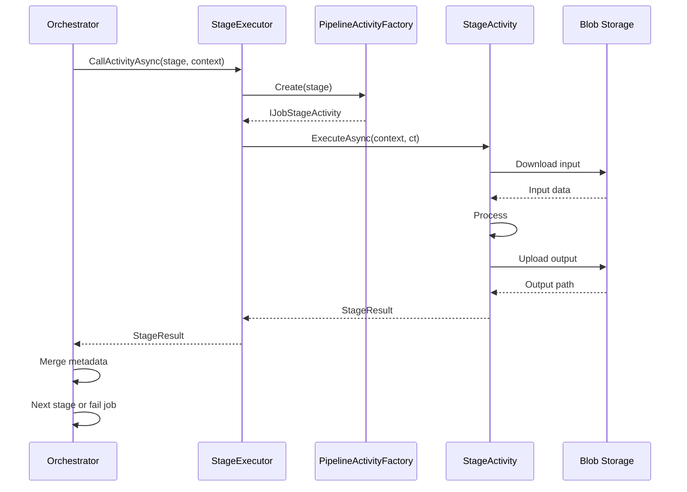

# Pipeline Stages

## Table of Contents

- [Purpose](#purpose)
- [Key Entities](#key-entities)
- [Constraints](#constraints)
- [Business Rules & Invariants](#business-rules--invariants)
- [Workflows & State Transitions](#workflows--state-transitions)
- [Decision Trees](#decision-trees)
- [Integration Points](#integration-points)
- [Edge Cases & Known Gotchas](#edge-cases--known-gotchas)

## Purpose

The pipeline stages define how a document is transformed from raw uploaded bytes into structured, searchable data. Each stage is a discrete processing step with well-defined inputs, outputs, and error semantics. The orchestrator drives stages sequentially, forwarding metadata between them.

## Key Entities



**StageMetadataKeys** — centralized constants for all metadata dictionary keys:

| Key | Type | Set by | Used by |
|-----|------|--------|---------|
| `jobId` | Guid | Orchestrator | All stages |
| `documentId` | Guid | Orchestrator | All stages |
| `blobContainer` | string | Orchestrator | OCR |
| `blobPath` | string | Orchestrator | OCR |
| `tenantId` | string | Orchestrator | OCR, Preprocess, Chunk |
| `extractionProfile` | string | Orchestrator | Extract |
| `ocrBlobPath` | string | OCR | Preprocess |
| `preprocessBlobPath` | string | Preprocess | Chunk |
| `chunkBlobPath` | string | Chunk | Embed |
| `totalChunks` | int | Chunk | — |
| `textChunks` | int | Chunk | — |
| `tableChunks` | int | Chunk | — |
| `totalTokens` | int | Chunk | — |
| `processingDurationMs` | long | Chunk | — |

## Constraints

### MUST

- **Each stage returns a `StageResult`**: Either `StageResult.Success(metadata)` or `StageResult.Failure(errorCode, message)`. No exceptions for expected business failures.
  - **Why**: The orchestrator uses the result to decide whether to continue or fail the job. Exceptions are reserved for truly unexpected errors.
  - **Enforced in**: `IJobStageActivity.ExecuteAsync()` contract, all stage activity implementations

- **Metadata accumulates across stages**: Each stage receives all metadata from prior stages and adds its own. The orchestrator merges result metadata into the context before calling the next stage.
  - **Why**: Downstream stages need outputs from upstream stages (e.g., Chunk needs `preprocessBlobPath` from Preprocess).
  - **Enforced in**: `DocumentProcessingOrchestrator` metadata merge loop

- **All metadata keys use `StageMetadataKeys` constants**: No hardcoded string keys in stage activities or tests.
  - **Why**: Prevents typos and key mismatches between producers and consumers. Enables compile-time checking and easy refactoring.
  - **Enforced in**: `StageMetadataKeys` static class, code review convention

### MUST NOT

- **Activity functions must not catch and swallow exceptions**: Let unexpected exceptions propagate to the orchestrator. Only catch exceptions that can be handled meaningfully (e.g., `OperationCanceledException`, `ArgumentException`).
  - **Why**: The orchestrator's error handling depends on receiving exceptions for retry decisions and job failure recording. Swallowing exceptions causes silent failures.
  - **Enforced in**: Convention; stage activities catch only specific exceptions and rethrow or return `StageResult.Failure` for the rest

- **Stages must not write to metadata keys owned by other stages**: Each stage owns specific keys (see table above).
  - **Why**: Overwriting upstream metadata would corrupt the context for other downstream stages.
  - **Enforced in**: Convention; each stage only adds its own keys

## Business Rules & Invariants

---

- **Rule**: Error codes are prefixed with the stage name (e.g., `OCR_MISSING_BLOB_PATH`, `CHUNK_ERROR`, `PREPROCESS_NOT_FOUND`).
- **Why**: When a job fails, the error code immediately identifies which stage failed without needing to inspect logs.
- **Enforced in**: Each stage activity's `StageResult.Failure()` calls
- **Example**: The Chunk stage cannot find the preprocessed blob. It returns `StageResult.Failure("CHUNK_PREPROCESS_NOT_FOUND", "...")`. The orchestrator records this on the ProcessJob.
- **Source**: `[SOURCE: code-audit — unconfirmed]`

---

- **Rule**: The `PipelineActivityFactory` resolves the correct `IJobStageActivity` implementation for each `ProcessJobStage` enum value.
- **Why**: Decouples the orchestrator from specific stage implementations. New stages are added by registering in DI and updating the factory.
- **Enforced in**: `PipelineActivityFactory.Create()`, DI registration in `DependencyInjection.cs`
- **Example**: `factory.Create(ProcessJobStage.Chunk)` returns an instance of `ChunkStageActivity`.
- **Source**: `[SOURCE: code-audit — unconfirmed]`

---

- **Rule**: Stage activities log start and completion with job context (JobId, CorrelationId, stage-specific metrics).
- **Why**: Enables observability and debugging of pipeline execution without inspecting blob storage.
- **Enforced in**: Each stage activity's `ExecuteAsync()` method
- **Example**: ChunkStageActivity logs: "Chunking completed. JobId={JobId}, TotalChunks=15, TotalTokens=4200"
- **Source**: `[SOURCE: code-audit — unconfirmed]`

## Workflows & State Transitions

### Stage Execution Flow



## Decision Trees

### Stage Failure Handling

```
IF stage returns StageResult.Success
  THEN merge metadata into context, advance to next stage
ELSE IF stage returns StageResult.Failure
  THEN record error code/message on ProcessJob, set status to Failed
ELSE IF stage throws OperationCanceledException
  THEN orchestrator handles cancellation (Durable Functions built-in)
ELSE IF stage throws unexpected exception
  THEN exception propagates to orchestrator catch block, job set to Failed
```

## Integration Points

- **Azure Blob Storage**: Stages read input from and write output to blob storage. Paths are passed via metadata keys. Container and path follow the pattern `{container}/{tenantId}/{documentId}/{stage}-result.json`.
- **Azure Durable Functions**: Each stage executor is an Activity Function. The orchestrator calls them via `context.CallActivityAsync()`. Durable Functions handles serialization, retry, and history.
- **DI Container**: Stage activities and their dependencies are registered in `DependencyInjection.cs`. The factory resolves them from the service provider.

## Edge Cases & Known Gotchas

- **TenantId fallback**: If `tenantId` is missing from metadata, stages that need it (OCR, Preprocess, Chunk) default to `"default"` and log a warning. This supports local development and testing but should not happen in production.
- **Blob path doubling**: There is a known pre-existing pattern where blob paths may double the container name (e.g., `chunk-results/chunk-results/...`). This affects PreprocessStageActivity and ChunkStageActivity identically and is tracked as tech debt to fix both together.
- **Metadata key casing**: All metadata keys use camelCase (e.g., `blobPath`, `totalChunks`). This was standardized across all stages; mixing PascalCase and camelCase caused lookup failures in earlier versions.
